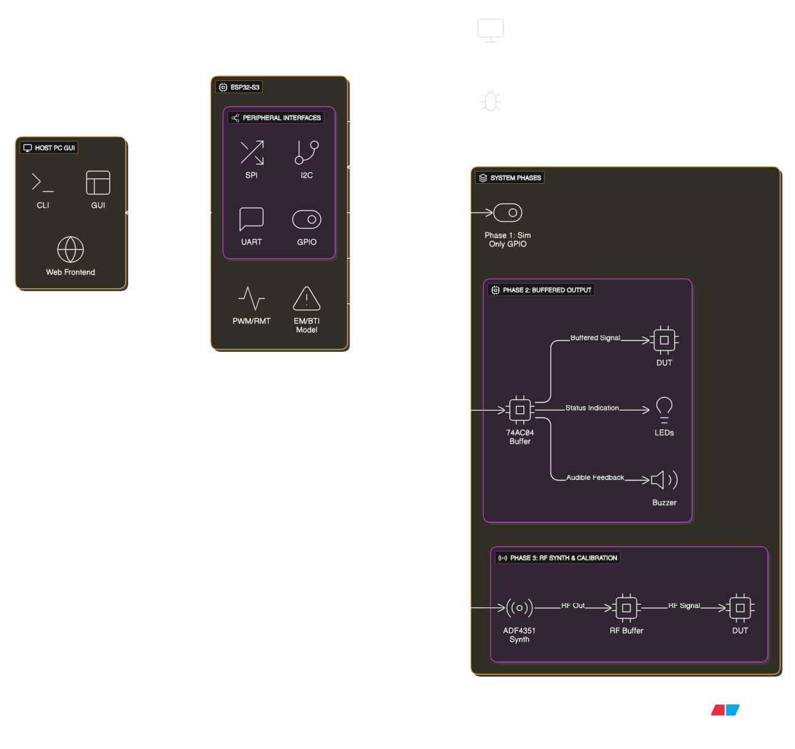

# Clock Stress Simulator

A modular, hardware-accelerated system for simulating and modeling clock waveform behavior, reliability degradation, and RF signal generation. Built using the ESP32-S3 microcontroller and scalable across 3 engineering phases.

---

## 📐 System Architecture Overview

The architecture is broken into three expandable phases:

| Phase | Description                         | Highlights                                              |
| ----- | ----------------------------------- | ------------------------------------------------------- |
| 1     | Software-only simulation            | Simulated GPIO + reliability metrics (EM, BTI)          |
| 2     | Buffered real-clock output          | PWM/GPIO + buffer driving to DUT                        |
| 3     | RF synthesizer + calibration engine | ADF4351 GHz clock source, TCXO reference, optional OLED |



---

## 🔧 Bill of Materials (BOM)

| # | Component            | Function                               | Phase | Source                                                  |
| - | -------------------- | -------------------------------------- | ----- | ------------------------------------------------------- |
| 1 | **ESP32-S3 DevKit**  | Core controller                        | All   | [AliExpress](https://s.click.aliexpress.com/e/_DdYiDB3) |
| 2 | 74AC04 Hex Inverter  | Signal buffer / logic shaper           | 2     | [AliExpress](https://s.click.aliexpress.com/e/_DFBh0c5) |
| 3 | ADF4351 Synth Module | RF signal generator (up to 4.4 GHz)    | 3     | [AliExpress](https://s.click.aliexpress.com/e/_Dmu5Xfb) |
| 4 | 10 MHz TCXO          | Reference clock for ADF4351            | 3     | [AliExpress](https://s.click.aliexpress.com/e/_DCmf4AT) |
| 5 | OLED I2C Display     | Optional display module (status/stats) | 3     | [AliExpress](https://s.click.aliexpress.com/e/_DdVzUdL) |
| 6 | Buzzer + LED         | Alerts for threshold crossings         | All   | [AliExpress](https://s.click.aliexpress.com/e/_DdoGM9h) |
| 7 | USB-C Cable          | Power and PC communication             | All   | Local                                                   |
| 8 | Breadboard + Wires   | Prototyping                            | 2/3   | [AliExpress](https://s.click.aliexpress.com/e/_DmWUG9L) |

---

## 🧩 Software Features

* Clock waveform generation via RMT/PWM (ESP32)
* BTI & EM modeling using TTF equations
* Live communication over USB Serial (Python GUI)
* Optional RF synthesis via ADF4351 with SPI config
* OLED status feedback and alerting

---

## 📁 Repository Structure

```
clock-stress-sim/
├── firmware_esp32/          # ESP32-S3 source code
│   ├── phase1_sim_gpio/
│   ├── phase2_buffered/
│   ├── phase3_rf_synth/
│   └── include/             # Shared headers
│
├── gui_app/                 # Python-based GUI (CustomTkinter / PyQt)
│   ├── main.py
│   ├── core/
│   └── assets/
│
├── configs/                 # JSON or YAML config files per phase
│   ├── phase1.json
│   ├── phase2.json
│   └── phase3.json
│
├── docs/                    # Diagrams, datasheets, and tech notes
│   ├── architecture_diagram.tex
│   ├── BOM.pdf
│   └── README_Clock_StressSim.md
│
├── hardware/                # Schematic, KiCad/Altium files, 3D prints
│   ├── pcb/
│   └── enclosure/
│
├── tests/                   # Automated test scripts and logs
│
├── .gitignore
├── README.md
└── LICENSE
```

---

## 🧠 Future Expansion Ideas

* Smith chart rendering from sweep+detector input
* BLE or WebSocket control
* Multi-phase switching with stored logs
* Remote control dashboard


